# **Marble It Up! Level Creation Kit**

## Table of Contents

- [Getting Started](#getstarted)
- [Create Your First Level](#firstlevel)
- [Skyboxes](#skyboxes)
- [Moving Platforms](#movingplats)
- [Special Surfaces](#surfaces)
- [Lightmap Settings](#lightmaps)

# **Overview**

The *Marble It Up!* Level Creation Kit is a system that allows you to create and test new Marble It Up! levels. The kit comes in two parts: a Unity Package to help build .level files, and a Map Tester application to load and playtest your generated .level files.
To get started creating custom *Marble It Up!* Levels you will need a few additional tools:

* Unity Editor (2017.2.1 or newer)
* Pro Builder Unity Asset (free) or other 3D Modeling software

Unity is needed to import the *MIU_LevelCreationKit.unitypackage* and export Unity Scenes as .level files. [ProBuilder](https://assetstore.unity.com/packages/tools/modeling/probuilder-111418) or another 3D Modelling program is needed to create the actual map geometry and generate UV maps.

In Unity 2018.1 and later, the latest version of ProBuilder can be installed from inside the editor.
From the Unity menu bar, select *Window > Package Manager* and then find ProBuilder in the list and click Install.

For Unity 2017.3 or older, you will have to use the older asset store version.

Once you have Unity and your model creation system of choice, you’re ready to start building!

Please also review the [Level Creation Kit EULA](https://github.com/MarbleItUp/MIULevelCreationKit/blob/master/LICENSE.md) before continuing.
<a name="getstarted"/>
# **Importing the UnityPackage**

Importing the Level Generation tools into Unity is easy!
From the Unity menu bar select *Assets > Import Package > Custom Package...*

 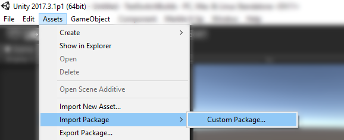

Then select *MIU_LevelCreationKit.unitypackage* which can be downloaded from this repository. Select Ok and wait for the package to complete importing.

You should see a new option on the Unity menu bar called "Marble It Up".

Now let’s make a few adjustments to the project so that what you see in the editor is as close as possible to what you’ll see in the game.
First, select Edit > Project Settings > Quality and adjust the settings to made this:

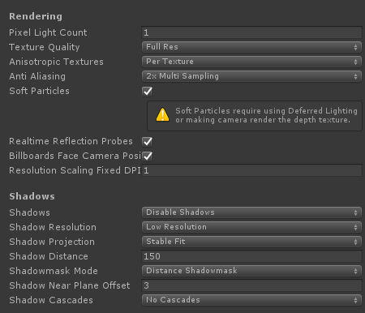

The most important part here is to Disable Shadows (as we’ll be baking lightmaps later) so you don’t see incorrect lighting information.
Next go to Edit > Project Settings > Graphics, scroll down, and adjust settings as shown:

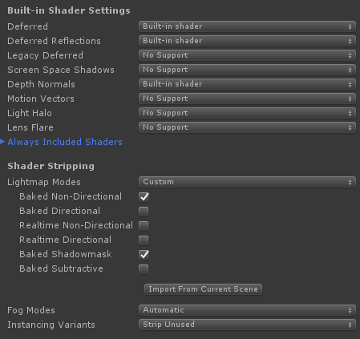

This will make sure that the lightmapping settings are always usable.
That’s it! You’re now ready to start making custom levels!

# **Learning To Roll**

Before we begin creating a new custom level, let’s take a look at the included demo scene of "Learning to Roll", which can be found in *Assets/MIU/Example*. In the Game and Scene windows you should see a familiar map!

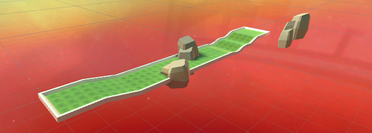

Let’s take a look at how it’s laid out in the Scene Hierarchy:
Here we can see that the level components are split into three groups **Gameplay**, **Static**, and **Skybox**.

The **Gameplay** group contains items that are specific to gameplay such as the Start/End pads, the level bounds, power-ups, moving platforms, gems, etc. 
The **Static** group contains all the map geometry that doesn’t move during play as well as the sun object for lighting direction. 
The **Skybox** group contains all the non-interactive objects and effects such as signs, clouds, and stars.

The final object is the Preview Camera which will provide the viewport in during level select.

<a name="firstlevel"/>
# **Your First Custom Level**

Now that we’ve checked out the example scene we can try making our own version of Learning to Roll. First we create a new scene by pressing Ctrl+N or selecting *File > New Scene*.

You should now have a blank scene with a *Directional Light*, and a *Main Camera*. First we want to set up the base scene so it’s ready to build upon. To do this, we want to open up the *Level Kit Window* which can be done by selecting *Marble It Up > Level Kit Window*. This will open up a new Unity Panel that should have a single button: *Setup Lighting*. Pressing this should reward you with a change in Skybox and a modified Scene Hierarchy where the Directional Light has been renamed to "Sun" and been moved into the Static/Lighting group. You can read more about picking a skybox in the Skybox section of this document.

Let’s add the base Learning to Roll level mesh so we can get started with Static Meshes. In the Project Window, navigate to *Assets/MIU/Internal/Meshes* and drag the LearningToRoll mesh into the Scene Hierarchy. Your scene view should now look like this:

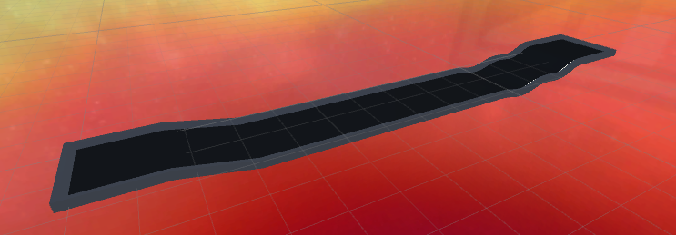

In the Scene Hierarchy open up the Learning to Roll object and you will find 6 objects that correspond to different sections of the level mesh. In the Inspector Window you should see a Mesh Renderer on each one of these objects.

Select **Cube (6)** and Open up the *Mesh Renderer* component by clicking on the arrow on the left side and you should see a list of Materials (open it up if closed by clicking on the arrow). You should see 3 Materials listed: *Tile01-AA*, *Fill01-C Local*, and *Edge C*. Material links are based on name, so these would work, but we have some sample materials to use that have actual graphics and are easier to work with.

We can find the correct materials in *MIU > Level Materials* in the Project Window. *Tile01-AA* is in the *Tiles/Blank* folder, *Fill01-C Local* is found in the *Geometry/Fills* folder, and *Edge C* is found in the *Trim* folder.

To replace the materials, you can drag them from the Project Window and drop them on top of the current material inside the Materials array (*Hint: You can lock the mesh to the inspector window using the lock icon at the top right of the window to prevent selecting the materials*).

Repeat that process for the remaining 5 objects in the LearningToRoll group and you should be rewarded with this:

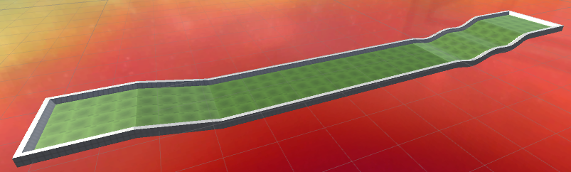

Now we have the visual meshes ready, but we need to make them physical! So, select all 6 objects inside the LearningToRoll object and press the Add Component button in the Inspector Window. Type in "*Mesh Collider*" and select that when it shows up. Then at the top right of the Inspector Window check the “*Static*” checkbox. This tells the Level Builder that the geometry won’t move and that it should treat it as collidable with the marble. Finally drag and drop the entire *LearningToRoll* object into the Static group in the Scene Hierarchy.

Now, any level requires a **Start Pad**, **End Pad**, and **Level Bounds** ... so lets make them!

Creating special gameplay items like Pads, Power-ups, Bumpers, etc is easy. Just open up the correct section in the *Level Kit Window* and click on button for the object you want to make. Let’s make a Start Pad, an End Pad, and the Level Bounds which are all under the *Core* section.

Let’s move the Start and End pads into their correct locations at the start and end of the level by using the movement arrows in the Scene view. Make sure to turn on the icons in the Gizmos dropdown in the Scene View and increase the 3D Icon Size so that they are clearly visible.

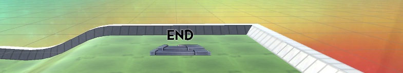

Once the Start and End pads are placed, lets adjust the Level Bounds so that it encompases the entire level. Select the LevelBounds object and adjust its position and Box Collider Size so that it fits nicely around the level.

Your resulting bounds should look something like this:

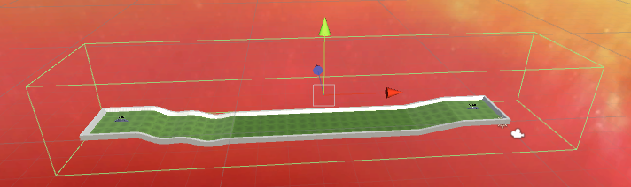

We’re almost ready to export the level, but lets add a rock and a bumper first.

You can add a bumper the same way you added the Start Pad, which is in Gameplay section of the *Level Kit Window*, place it wherever you like on the level.

Now let’s also create a Rock. There are a number of different customizable objects available to add into your levels, they can be found in the Prefabs folder ( *MIU/Prefabs* ). To use one, just drag it into the Scene View or the Hierarchy. Let’s bring out RockFormation1.

The difference between objects we create from the Level Kit Window and objects from the Prefabs folder is that Created objects can be moved/rotated/scaled but otherwise can’t be modified, whereas objects from the Prefabs folder can be modified and added to.

For example, let’s take our RockFormation1 that we brought into the scene and add *another* rock to it, creating an entirely new formation! Just copy and paste Rock1 inside the formation and then move that around to wherever you want.

Now your scene should look something similar to this:

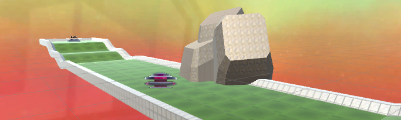

Let’s make sure to save our new scene (Ctrl+S or File > Save Scene) so that we can run our lightmapper.

Select *Window > Lighting > Settings* from the Unity menu bar. The Set Up Lighting command we ran at the start already configured our light settings, so all we need to do is hit Generate Lighting at the bottom right. This might take a few minutes depending on your computer, but at the end you should be rewarded with something like this:

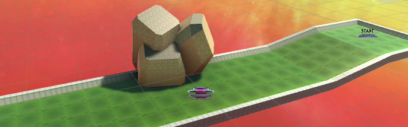

The final step is to set up the preview camera. In your Scene View using WSAD move your viewport to get a good view of your map. Then select the Main Camera object in the Scene Hierarchy and select *GameObject > Align With View* so that the camera matches what you see in the Scene viewport.

Now we’re ready to test. To create your .level file select Marble It Up > Level Baker. This will open up a new window with a "Bake" button. Press that and voilà! A level file has been created in your Assets folder.

To test it out, we’ll need to launch *Marble It Up!* on Steam in Level Testing mode. Open that up, select Load Map, and select the newly created .level file (which is named the same as your saved scene name).

If everything works as intended you should be rewarded with a view of your custom map:

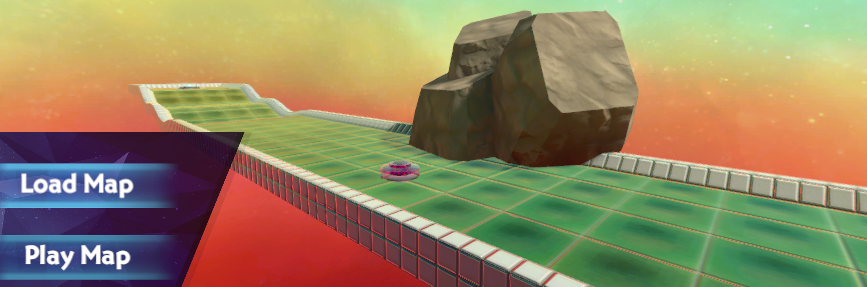

Just press Play to try it out!
<a name="skyboxes"/>
# **Skyboxes**

While the Level Kit only comes with one template skybox, you can still use any of the skyboxes inside Marble It Up! for your custom map.

First, find Sky001 in the Resources folder, then Duplicate it (Select > Ctrl+D). All that is needed is to Rename your new Sky002 to the appropriate skybox number (ie "25" instead of "Sky002") and set it to be the skybox at the top of the Lightmap Settings (*Window > Lighting > Settings*). The sky will look the same as Sky001 in the editor, but when you test the level file, it will use the correct sky material.

The following page contains the Skies that can be used by changing the name of the Skybox material:

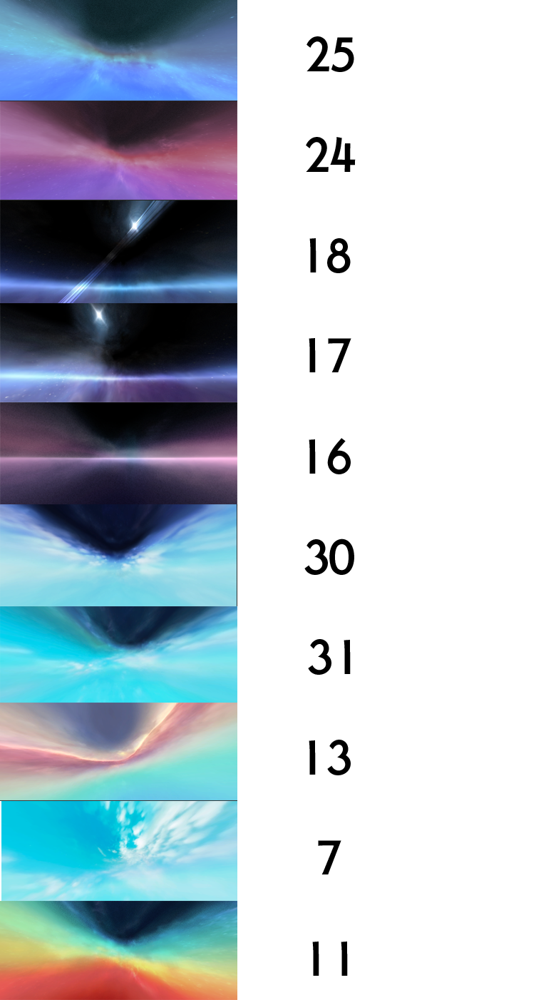
<a name="movingplats"/>
# **Moving Platforms**

Moving Platforms can be created by editing the existing prefabs or by creating your own from scratch by adding an Elevator Mover component to a GameObject.

The following properties can be modified to change how the platform behaves:

- **Start Offset Time** - Time before elevator begins moving when Play starts
- **Wait For Touched** - Wait for marble to touch before moving
- **Delta** - Positional Movement over duration
- **Delta Rotation** - Rotational Movement over duration
- **Pause Time** - Time to Pause after each movement period
- **Move Time** - Time taken per movement period
- **Move First** - Move before pausing / pause before moving (at start)

- **Enable Bob** - For rotating platforms, allows the platform to bob up at down at a set interval (sine curve)
- **Bob Vector** - Distance vector for the bobbing motion
- **Bob Period** - Duration of a single bob phase
- **Bob Offset** - Time offset to allow multiple different cycle repeat times

Moving Platforms must also have a Mesh Collider component to work properly due to how the physics system works. It is recommended, but not required, to also have Mesh Renderer and Mesh Filter components so that the moving platform physics bounds are visible in the game.

Moving Platforms can also serve as groups, holding other GameObjects inside them such as gems, power-ups, and other collision meshes. Keep in mind that nesting many objects inside moving platforms will increase physics solve complexity and can reduce performance.

## Spline Elevators

By changing the Elevator Mover mode to *Spline* you can set up a bezier curve for the mover to follow. You can use the Spline Speed to determine how fast the mover traverses the spline and the Keep Orientation to prevent the mover from rotating during movement. The *Spline GO* section is where you will define your root spline object.

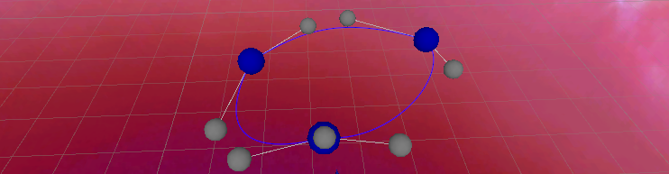
To create a new spline, create an empty GameObject and add the Spline Drawer component to it. Then add at least 4 additional empty GameObjects as children of that SplineDrawer object, you should see a blue sphere appear. Move the child objects around and you will see a spline form, this will be the path that your elevator mover takes. Set the *Spline GO* to the Spline Drawer object and any exported map should have the Elevator Mover trace that spline path.

## Basher

The Basher prefab is a special Moving Platform used to knock mables off the map. To maintain consistency with other maps, the best practice is to only modify the Delta value of the Elevator Mover component and object’s position and rotation.
<a name="surfaces"/>
# **Special Surfaces**

*Marble It Up!* has a number of physics surfaces that affect the marble’s movement. You can find them in the *MIU/Level Materials/Surfaces* folder.

*surface.lowfriction* - This is the Ice surface: anywhere this material is used will cause the marble to slide around. This surface is straightforward in use and does not need any special consideration.

*surface.gravity* - This is the Gravity surface: anywhere this material is used will cause gravity to shift, such that the surface area touched is facing upward. The actual implementation of this surface gives some leniency to ‘touch’ and thus the area affected while in contact is larger than the actual contact area. For this reason it is highly suggested not to use this material on small objects with complex surfaces over a small area as gravity is likely to rapidly shift as the game tries to determine which way should be up based on many different points.

*Lava.crush* - Instantly kills marble on contact. This is a sub-surface of the Crusher object in official levels but can be used as a normal surface as well.

<a name="lightmaps"/>

# Lightmap Settings

The level file format allows encoding of lightmaps to add fantastic visual fidelity to custom levels. With this feature comes the possibility for extremely large file sizes if not properly checked. Due to this the MIU Level Kit will enforce lightmap texture compression, ensuring that level files are as small as possible. Due to some engine limitations, this process can't be completely automated and will require some tweaking to get working correctly. This section is meant to explain what compression type the Level Kit requires and how to achieve it.

If your lightmap settings have been configured correctly, when you generate lighting for a level you should have two new textures - a Lightmap and a Shadowmap. Lightmaps create the color values of the lighting, and the shadowmap acts as a mask, telling the lighting where to use the lightmap texture on the geometry. These two textures need different features (Lightmap needs transparency values). Due to this we have found that the best 'small footprint' textures to use that are *Unity Version Independent* are **DTX5 Compressed** for Lightmap and **DTX1 Compressed** for Shadowmap, both with Crunch compression enabled.

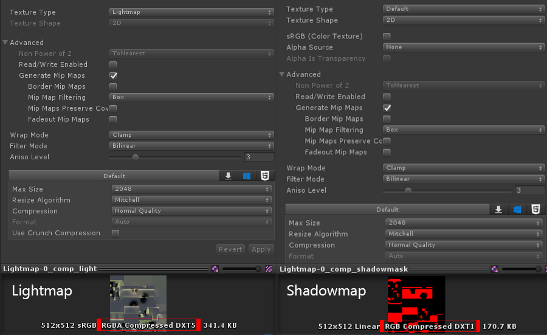

The image above shows how to achieve this texture compression setting in Unity 2017.3 but there may be differences in newer/older Unity versions. The important thing is to get DTX1/DTX5 Compressed format to show at the bottom of the texture preview image. Without these compression settings your level will fail to export.

## Lightmaps with Imported Models

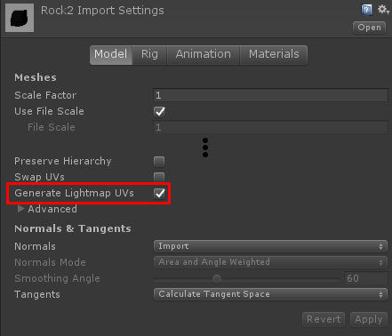

Lightmapping imported models from external 3D applications is supported, but it is important to ensure that *Generate Lightmap UVs* is checked in the model import settings to ensure smooth lightmapping data.
